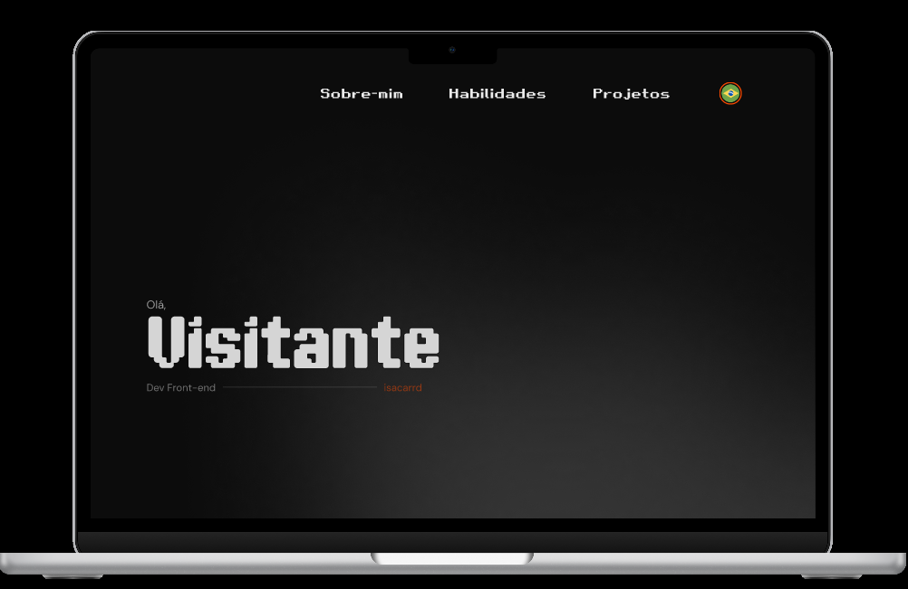
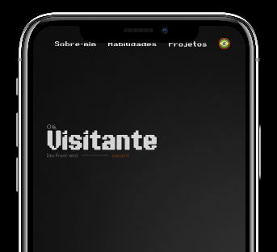

<h1 align="center" style="font-weight: bold;">Portfólio</h1>

<p align="center">
  <a href="#objective">Objetivo</a> • 
  <a href="#tech">Tecnologias</a> • 
  <a href="#started">Começando</a> • 
</p>

<p align="center">
    <b>Portfólio autoral de Isabele Cardoso (isacarrd)</b>
</p>

<p align="center">
     <a href="#">🚦 Projeto</a>
     <a href="https://www.figma.com/community/file/1642193222061811502">🚧 Figma</a>
</p>

<h2 id="layout">🎨 Visão da página</h2>

<div align="center">
    
    
</div>

<h2 id="objective">💡 | Objetivo</h2>

Esta página visa provar habilidades práticas de domínio e ferramentas técnicas, credibilidade profissional, facilitar a avaliação de recrutadores e gestores, servindo também como um histórico de aprendizado contínuo.

O que foi aplicado:

- Componentes inteligentes.
- Troca de idioma com a solução de internacionalização i18n.
- Formulário de contato.
- Personalização.
- Tags semânticas e acessibilidade.
- Media Queries | Responsividade.
<br> <br>

<h2 id="technologies">💻 | Tecnologias</h2>
  
  
  
  
  <h3>Ferramenta de Build: </h3>
  
  <br>

<h2 id="started">🚀 | Começando</h2>

Quer rodar este projeto localmente? Aqui está sua solução!
- <a href="https://www.i18next.com/" target="_blank"> Docs do i18next </a>
- <a href="https://www.emailjs.com/docs/sdk/installation/" target="_blank"> Docs do EmailJS </a>
- <a href="https://github.com/ruucm/shadergradient" target="_blank"> Docs do ShaderGradient </a>
- <a href="https://reactbits.dev/text-animations/text-type?typingSpeed=130" target="_blank"> Docs do React Bits </a>

<h3>Clonando</h3>

Como clonar este projeto:

```bash
git clone https://github.com/isacarrd/portifolioIsacarrd
```
<br>

Instalar dependências:
```bash
npm install
```

- Instalando o i18n:
```bash
npm install i18next react-i18next i18next-browser-languagedetector
```

- Instalando o EmailJS:
```bash
npm install --save @emailjs/browser
```

- Instalando o ShaderGradient:
```bash
npm i @shadergradient/react @react-three/fiber three three-stdlib camera-controls
npm i -D @types/three
```

- Instalando animação do React bits(gsap):
```bash
npm install gsap
```

<br>

Rodar aplicação:
```bash
npm run dev
```
